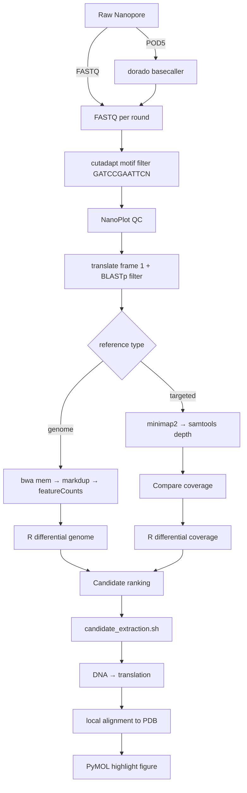

# Nanopore MinimumBIO

An end-to-end, config-driven workflow for analysing Nanopore-sequenced biopanning experiments, from raw FASTQ or POD5 to differential enrichment statistics and protein-structure highlights.

## Overview

Nanopore MinimumBIO processes T7 phage-display peptide libraries that have been selected against a bait of interest. It takes paired experimental and control sequencing reads, organised by panning round (`R0`, `R1`, ... `Rn`), and produces:

- per-round QC reports and filtered FASTQ/BAM files,
- gene-level counts or per-reference coverage,
- differential-enrichment statistics and plots,
- candidate DNA/protein sequences, and
- PyMOL structure highlights on an AlphaFold PDB model.

The workflow is controlled by a single YAML configuration file and a small dispatcher, `bin/minbio`.

## Key capabilities

- **End-to-end Nanopore biopanning analysis**: raw signal or FASTQ → candidate prioritisation → protein structural interpretation, implemented in `workflow/preprocess_fastq.sh`, `workflow/preprocess_pod5.sh`, `workflow/candidate_extraction.sh` and `workflow/structure_mapping.sh`.
- **Protein-aware read filtering**: reads are translated in frame 1 and filtered with BLASTp against a protein database before alignment, implemented in `workflow/preprocess_fastq.sh` and `workflow/coverage_workflow.sh`.
- **Two-reference strategy**: genome-wide mode (`bwa` + `featureCounts`) for annotated genomes, and targeted mode (`minimap2` + `samtools depth`) for personalised or amplicon references, implemented in `workflow/quantify_genome.sh` and `workflow/coverage_workflow.sh`.
- **Round-resolved enrichment statistics**: CPM normalisation, growth-rate computation, and polynomial-trend or t-test differential analysis across panning rounds, implemented in `R/differential_genome.R` and `R/differential_coverage.R`.
- **Sequence-to-structure integration**: candidate regions are extracted from BAM/GTF, translated to peptide, locally aligned to a PDB sequence, and highlighted in PyMOL, implemented in `workflow/candidate_extraction.sh` and `workflow/structure_mapping.sh`.
- **Config-driven reproducible CLI**: all paths and parameters live in one YAML file; `bin/minbio` dispatches stages and `scripts/check_env.sh` validates dependencies.

## Workflow



## Workflow modes

### Genome mode (`mode: genome`)

Use this when you have a genome-wide reference and a gene annotation GTF.

- **Input**: FASTQ or POD5 per round.
- **Aligner**: `bwa mem` with the ONT preset configured in `alignment.bwa_preset`.
- **Quantification**: `featureCounts` on the final marked/sorted BAM.
- **Differential analysis**: `R/differential_genome.R` (trend regression or t-test).

### Targeted mode (`mode: targeted`)

Use this when you only have a small custom reference, such as a synthetic T7-Pep library or amplicon, without a full annotation.

- **Input**: FASTQ per round.
- **Aligner**: `minimap2 -ax map-ont`.
- **Quantification**: `samtools depth` → top-1000 coverage loci.
- **Differential analysis**: `R/differential_coverage.R` with optional UniProt id-mapping.

## Installation

1. Clone the repository and switch to the `refactor/v2` branch (do not modify `main`):

   ```bash
   git clone <repository-url>
   cd Nanopore_MinimumBIO
   git checkout refactor/v2
   ```

2. Create the conda environment:

   ```bash
   conda env create -f envs/environment.yml
   conda activate minbio
   ```

3. Install the required R packages:

   ```r
   install.packages(c("ggplot2", "dplyr", "tidyr", "readr", "ggrepel"))
   if (!requireNamespace("BiocManager", quietly = TRUE))
       install.packages("BiocManager")
   BiocManager::install(c("edgeR", "rtracklayer"))
   ```

   See `envs/r-packages.txt` for the full list.

4. Install Dorado manually. Dorado is Oxford Nanopore Technologies software and is not redistributed in the conda environment. Download it from the ONT documentation and ensure `dorado` is on your `PATH` before running POD5 workflows.

5. (Optional) Install PyMOL for automated structure rendering. The workflow will still write `.pml` scripts if PyMOL is missing.

## Quick start

```bash
# 1. Validate the environment
./bin/minbio check --config config/config.example.yaml

# 2. Copy and edit the example config for your data
cp examples/config.fastq.yaml config/my_experiment.yaml
# edit config/my_experiment.yaml

# 3. Run the pipeline stages in order
./bin/minbio preprocess --config config/my_experiment.yaml
./bin/minbio quantify   --config config/my_experiment.yaml
./bin/minbio analyse    --config config/my_experiment.yaml
./bin/minbio candidates --config config/my_experiment.yaml
./bin/minbio structure  --config config/my_experiment.yaml
```

For POD5 input use `examples/config.pod5.yaml`; for a targeted reference use `examples/config.targeted.yaml`.

## Input

The experiment and control folders must share the same round-based layout. Round directories are matched by name (default pattern `R*`):

```
/path/to/experiment/
├── R0/
│   └── round0.fastq.gz
├── R1/
│   └── round1.fastq.gz
└── ...

/path/to/control/
├── R0/
│   └── control_round0.fastq.gz
├── R1/
│   └── control_round1.fastq.gz
└── ...
```

See `examples/example_tree.md` for the complete layout and POD5 variants.

## Output

Per round, under each round directory:

- `all_sequences.fastq.gz` — merged input,
- `step1/all_trimmed.fastq.gz` — adapter-filtered reads,
- `step1/all_filtered_sequences.fastq.gz` — BLASTp-filtered reads,
- `step2/*_sorted.bam` / `*_marked.bam` — aligned reads,
- `quality_control/all_trimmed_nanop/` — NanoPlot QC report,
- `step3/*_combined_expression_counts.txt` — gene counts (genome mode),
- `step2/coverage.txt` / `top_1000_positions.txt` — coverage summaries (targeted mode).

Per experiment:

- `<exp_folder>/Routput/` — differential-analysis plots and tables,
- `<exp_folder>/potential_hit/<round>/` — candidate DNA and translated proteins,
- `<exp_folder>/potential_hit/<round>/visualization/` — PyMOL `.pml`, `.pse` and PNG renders.

## Configuration

All paths and parameters are set in a YAML file. Copy one of the examples and edit the values:

- `experiment.name`, `experiment.exp_folder`, `experiment.control_folder`, `experiment.round_pattern`
- `mode`: `genome` or `targeted`
- `input.type`: `fastq` or `pod5`; POD5-specific Dorado settings
- `reference.fasta`, `reference.annotation` (genome), `reference.id_mapping` (targeted, optional)
- `filtering.adapter`, `filtering.min_protein_length`, `filtering.protein_db`, `filtering.blast_evalue`
- `alignment.threads`, `alignment.bwa_preset`, `alignment.mark_duplicates`
- `analysis.method`, `analysis.pvalue_threshold`, `analysis.log10cpm_threshold`
- `structure.genes`, `structure.uniprot_id`, `structure.pdb_path`, `structure.chr_prefix`

See `config/config.example.yaml` for a fully annotated template.

## Differential analysis

### Genome mode

`R/differential_genome.R` reads per-round `featureCounts` output, computes CPM, and compares experiment vs control. It supports two methods:

- `trend` — first-degree polynomial trend regression across rounds on the mean experiment–control difference.
- `ttest` — unpaired t-test of experiment vs control per gene across rounds.

Outputs include a volcano plot, PCA plot, trajectory line plot, and a table of differential values.

### Targeted mode

`R/differential_coverage.R` reads the per-round `differential_coverage.txt` files produced by `workflow/coverage_workflow.sh --stage compare`, normalises coverage to CPM, and produces a volcano plot and (when ≥2 rounds are available) a trajectory line plot. If a UniProt id-mapping TSV is supplied, gene names are added to the coverage tables.

## Candidate discovery

`workflow/candidate_extraction.sh` extracts reads overlapping the genes configured in `structure.genes` (genome mode) or the top coverage BEDs (targeted mode), converts them to BED coordinates, pulls the corresponding DNA from the reference with `bedtools getfasta`, and translates the DNA in frame 1 using `scripts/translate_dna.py`. Outputs are written to `<folder>/potential_hit/<round>/` to keep multi-round results separate.

## Structural interpretation

`workflow/structure_mapping.sh` aligns the translated candidate peptides against the AlphaFold PDB sequence with `scripts/pdb_align.py`, then writes a PyMOL script that highlights the matched residue range on the structure. If PyMOL is installed it runs headlessly; otherwise the `.pml` script is saved for manual execution.

## Repository structure

```
Nanopore_MinimumBIO/
├── bin/minbio                       # CLI dispatcher
├── config/config.example.yaml       # annotated config template
├── docs/                            # user and methodology docs
│   ├── beginner_setup.md
│   ├── workflow.md
│   ├── methodology.md
│   ├── project_history.md
│   ├── legacy_workflows.md
│   └── troubleshooting.md
├── envs/
│   ├── environment.yml              # conda environment
│   └── r-packages.txt               # R package list
├── examples/                        # example configs and directory layout
├── R/                               # differential analysis scripts
├── scripts/                         # helpers (common.sh, check_env.sh, python)
├── tests/smoke_test.sh              # syntax/config validation
├── workflow/                        # modular workflow scripts
└── legacy/                          # original pipelines preserved verbatim
```

## Reproducibility

- All workflow scripts use `set -euo pipefail` and a shared logging/config loader (`scripts/lib/common.sh`).
- Tool versions are captured in `envs/environment.yml`; R packages are listed in `envs/r-packages.txt`.
- `scripts/check_env.sh` reports missing tools, R packages, and FASTA/GTF chromosome-naming consistency.
- `tests/smoke_test.sh` validates shell/R syntax and YAML parsing without requiring the heavy bioinformatics tools.
- Every behavioural change from the legacy pipelines is documented in `docs/legacy_workflows.md`; nothing is silently altered.

## Limitations

Please interpret results as exploratory rather than definitive:

- **No replicates assumed**: panning rounds are treated as ordered time points, not independent biological replicates. P-values are for ranking, not formal hypothesis testing.
- **Translation frame assumption**: candidate sequences are translated in reading frame 1. Peptides that are genuinely enriched in another frame may be missed.
- **Chromosome naming**: the FASTA and GTF must use the same chromosome style (e.g. both `chr1` or both `1`). `scripts/check_env.sh` catches mismatches.
- **Dorado licensing**: basecalling requires a separate manual install of ONT Dorado; it is not included in the conda environment.
- **Legacy naming**: the original genome script was called `Pipeline1_limma.R`, but no limma modelling is performed (`lmFit`/`eBayes` are not used). The v2 script is `R/differential_genome.R` and uses edgeR CPM plus trend regression or t-test.

## Citation

If you use this workflow, please cite the repository and acknowledge the underlying tools (Dorado, cutadapt, BWA, minimap2, featureCounts, samtools, BLAST+, edgeR, etc.).

## Author

Chen Zhu
