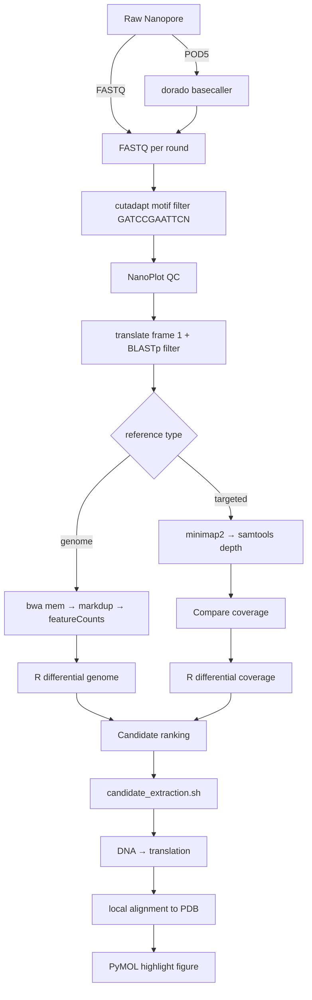

# End-to-end workflow

This document describes the complete Nanopore MinimumBIO pipeline, the inputs and outputs of each stage, and the scripts that implement them.

## Mermaid diagram

## Stage 0: Environment check

**Script**: `scripts/check_env.sh --config <yaml>`

**What it does**:

- Reports required tools (cutadapt, seqkit, seqtk, blastp, makeblastdb, bwa, minimap2, samtools, featureCounts, NanoPlot, bedtools, python3, Rscript).
- Reports optional tools (dorado, pymol, pod5).
- Checks that required R packages are installed.
- Loads the config and checks that `reference.fasta` exists.
- Compares chromosome-name style between the FASTA and GTF and fails loudly on a mismatch.

**Outputs**: log messages to stderr; non-zero exit if anything required is missing.

## Stage 1: Preprocessing

### Genome mode from FASTQ

**Script**: `workflow/preprocess_fastq.sh --config <yaml>`

**Inputs**: `experiment.exp_folder` and `experiment.control_folder`, each containing round directories with `.fastq` or `.fastq.gz` files.

**Per round**:

1. Merge all FASTQ files in the round into `all_sequences.fastq.gz` (excluding prior `all_*` files).
2. Run `cutadapt` with the motif in `filtering.adapter` (default `GATCCGAATTCN`).
3. Run `NanoPlot` for QC on the trimmed reads.
4. Translate the trimmed reads in frame 1 with `seqkit translate`, apply the minimum protein length filter, and run `blastp` against `filtering.protein_db`.
5. Keep only reads whose translated protein has a BLAST hit and write `step1/all_filtered_sequences.fastq.gz`.
6. Align with `bwa mem -x <bwa_preset>`.
7. Sort the BAM and optionally mark duplicates.
8. Index the final BAM.

**Outputs**:

- `all_sequences.fastq.gz`
- `step1/all_trimmed.fastq.gz`
- `step1/all_filtered_sequences.fastq.gz`
- `step1/all_translated_sequences.faa.gz`
- `blastp_results/all_trimmed_blastp.txt`
- `step2/*_sorted.bam` and optional `step2/*_marked.bam`
- `quality_control/all_trimmed_nanop/`

### Genome mode from POD5

**Script**: `workflow/preprocess_pod5.sh --config <yaml>`

**Inputs**: `input.pod5_dir` plus the experimental round directories.

**Per round**:

1. Locate the POD5 directory for the round. The script accepts either `<pod5_dir>/<round>/` or `<pod5_dir>/pod5_pass/<round>/` so that it is compatible with the standard Dorado pass/fail directory layout. Only pass reads are used.
2. Basecall with `dorado basecaller --device <device> <model> <pod5_dir> > basecalled.bam`.
3. Convert the BAM to FASTQ with `samtools fastq` and gzip it into the round directory.
4. Write a flagstat report.
5. Delegate the rest of the workflow to `workflow/preprocess_fastq.sh`.

**Outputs**: basecalled BAM, FASTQ, flagstat report, plus all outputs from `preprocess_fastq.sh`.

### Targeted mode

**Script**: `workflow/coverage_workflow.sh --config <yaml> --stage preprocess`

**Inputs**: `experiment.exp_folder` and `experiment.control_folder` with FASTQ round directories, plus a targeted FASTA reference.

**Per round**:

1. Merge FASTQ files.
2. Run `cutadapt` motif filter.
3. Run `NanoPlot`.
4. Translate and BLASTp-filter as in genome mode.
5. Align with `minimap2 -ax map-ont`.
6. Sort and index the BAM.
7. Compute per-position coverage with `samtools depth`.
8. Aggregate coverage per reference sequence and select the top 1000 loci.
9. Write one BED file per top locus into `step2/visualization/`.

**Outputs**:

- `all_sequences.fastq.gz`
- `step1/all_trimmed.fastq.gz`
- `step1/all_filtered_sequences.fastq.gz`
- `step2/aligned_sorted.bam`
- `step2/coverage.txt`
- `step2/top_1000_positions.txt`
- `step2/visualization/<reference>.bed`

## Stage 2: Quantification / comparison

### Genome mode

**Script**: `workflow/quantify_genome.sh --config <yaml>`

**Inputs**: sorted/marked BAMs from preprocessing and a GTF annotation.

**Per round**:

1. Find the final BAM (`*_marked.bam` if markdup is enabled, otherwise `*_sorted.bam`).
2. Run `featureCounts -L -T <threads> -a <gtf> --ignoreDup` (when markdup is enabled) on the final BAM only.

**Outputs**:

- `step3/<round>_combined_expression_counts.txt`

### Targeted mode

**Script**: `workflow/coverage_workflow.sh --config <yaml> --stage compare`

**Inputs**: `step2/top_1000_positions.txt` from experimental and control rounds.

**Per matched round pair**:

1. Read the top-1000 coverage tables for the experiment and the matching control round.
2. Compute `Experimental_Coverage - Control_Coverage`.
3. Sort by difference and write a proper header.

**Outputs**:

- `<exp_round>/differential_coverage.txt`

## Stage 3: Differential analysis

### Genome mode

**Script**: `R/differential_genome.R --exp <dir> --control <dir> --gtf <gtf> --out <dir> --method <trend|ttest> --pvalue <n> --log10cpm <n> --top-label <n> --top-trajectory <n> --round-pattern <pattern>`

**What it does**:

1. Discover matched round directories.
2. Read `featureCounts` outputs and compute CPM with edgeR.
3. Compute per-round experiment–control differences (mean over sample columns per round).
4. Run either polynomial-trend regression or an unpaired t-test per gene.
5. Add BH-adjusted p-values and apply the user-supplied significance threshold.
6. Compute the legacy growth-rate definition: `(last_round - first_round) experiment–control`.
7. Save a volcano plot, PCA plot, trajectory line plot, and CSV table.

**Outputs**: in the configured output directory (default `<exp_folder>/Routput/`):

- `differences_df_named_no_variance.csv`
- `pca_plot.png`
- `line_plot.png`
- `<method>_volcano_plot.png`

### Targeted mode

**Script**: `R/differential_coverage.R --exp <dir> --out <dir> [--id-mapping <tsv>]`

**What it does**:

1. Read each round's `differential_coverage.txt`.
2. Normalise control and experimental coverage to CPM.
3. Optional: map identifiers through a UniProt id-mapping TSV.
4. Save updated per-round coverage tables.
5. If ≥2 rounds are available, plot the top-variable trajectories.
6. Plot a volcano for the last round.

**Outputs**:

- `updated_<round>_differential_coverage.txt` per round
- `line_plot.png` (when ≥2 rounds)
- `volcano_plot.png`

## Stage 4: Candidate extraction

**Script**: `workflow/candidate_extraction.sh --config <yaml>`

### Genome mode

For each gene in `structure.genes`:

1. Extract exon coordinates from the GTF by exact `gene_name` match.
2. Subset the round BAM to reads overlapping those exons.
3. Convert the subset BAM to BED with `bedtools bamtobed`.
4. Extract DNA with `bedtools getfasta`.
5. Translate with `scripts/translate_dna.py`.

### Targeted mode

For each top-coverage BED in `step2/visualization/`:

1. Extract DNA from the targeted reference.
2. Translate with `scripts/translate_dna.py`.

**Outputs**: under `<folder>/potential_hit/<round>/`:

- `<gene>_exons.bed` (genome)
- `<gene>_Hit_*.bam` (genome)
- `<gene>_high_coverage_sequences.fa`
- `<gene>_translated_proteins.fa`

The per-round `potential_hit/<round>/` layout avoids collisions when the same gene appears in multiple rounds.

## Stage 5: Structural interpretation

**Script**: `workflow/structure_mapping.sh --config <yaml>`

**What it does**:

1. Find translated protein FASTAs matching `structure.genes` under `potential_hit/`.
2. For each protein FASTA, call `scripts/pdb_align.py` to locally align the peptides against the PDB sequence.
3. Write a PyMOL script (`*_highlight.pml`) that highlights the aligned residue range.
4. If PyMOL is installed, run it headlessly to produce a `.pse` session and a 300 dpi PNG.

**Outputs**:

- `<folder>/potential_hit/<round>/visualization/<gene>_highlight.pml`
- `<folder>/potential_hit/<round>/visualization/<gene>_highlighted_structure.pse`
- `<folder>/potential_hit/<round>/visualization/<gene>_highlighted_structure.png`

If PyMOL is not installed, the `.pml` script is still written so you can run it manually with `pymol -c -q <script>.pml`.
